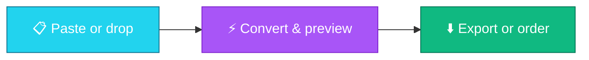

<div align="center">

# <span style="display:inline-grid;place-items:center;width:56px;height:56px;border-radius:16px;background:linear-gradient(135deg,#22d3ee,#a855f7);color:white;font-size:32px;font-weight:900;">ব</span>

# BornoLab — বাংলা Font & Document Suite

[](https://nextjs.org)
[](https://www.typescriptlang.org)
[](https://tailwindcss.com)
[](https://www.framer.com/motion/)
[](#-private-by-design)

[](https://git.io/typing-svg)

**The all-in-one Bangla toolkit for creators, authors, students & DTP studios.**

_Convert • Fonts • Styler • PDF⇆DOCX • Splitter • Software — fast, free, private._

<p>
  <a href="#-tools-at-a-glance"></a>
  <a href="https://github.com/proffesergio/bornolab"></a>
</p>

> ⭐ **Love BornoLab?** Star the repo — it helps Bangladeshi creators discover free Bangla tools.

</div>

---

## ✨ Why you'll love it

| | |
|---|---|
| ⚡ **Instant, client-first** | Converting, splitting & translating run **100% in your browser**. No uploads, no waiting. |
| 🔒 **Private by design** | Your documents never leave your device for core tools. |
| 📰 **Newsroom-grade Bijoy engine** | Correct pre-kar, reph, ya-fala & juktoborno handling — `কার, য-ফলা, রেফ নির্ভুল`. |
| 🎨 **Dark-first glassmorphism** | Gorgeous light/dark UI with neon glows, smooth Framer Motion transitions. |
| 📚 **Built for Bangladesh** | Newspapers, authors, creators, students, offices — real workflows, not demos. |
| 💳 **Local payments** | Premium fonts & software with **bKash, Nagad, Bank & Binance**. |

---

## 🧰 Tools at a glance

<div align="center">

| Tool | What you get | Perfect for |
|---|---|---|
| 🔄 **Unicode ⇆ Bijoy** `/convert` | Newsroom-grade encoding engine with live Bangla ghost preview, one-click copy | DTP, newspapers, Bijoy archives |
| 🔤 **Font Directory** `/fonts` | 15+ Bangla & Latin faces, live preview, size slider, filters | Designers, publishers, creators |
| ✨ **Decorator & Styler** `/styler` | Neon, outline, gradient, glitch + frames & symbol wings | Facebook, YouTube, TikTok captions |
| 📄 **PDF ⇆ DOCX** `/translate` | Editable docs with tables & flow preserved — no text-box soup | Students, offices, authors |
| ✂️ **PDF Splitter** `/split` | Thumbnails + ranges like `1-3, 5, 7-12` → PDF / JPG-PNG zip / DOCX | Admissions, circulars, homework |
| 💽 **Software Store** `/software` | Free OCR, font manager, templates + pro tools with license | DTP pros & studios |

</div>

---

## 🎬 See it in action

<details open>
<summary><b>🔄 Unicode ⇆ Bijoy — the painkiller</b></summary>

<br />

**Why does Bijoy look like English letters?** Bijoy (ANSI) fonts reuse Latin slots for Bangla glyphs. Without SutonnyMJ installed, browsers show raw Latin codes. BornoLab detects this and shows a live auto-converted Bangla preview.

```text
Unicode input:   আমার সোনার বাংলা, আমি তোমায় ভালোবাসি
Bijoy output:    Avgvmo †mvvovi evsjv, Avwg †Zvgv‡K fv‡jvevwm (SutonnyMJ rendering)
Ghost preview:   👁 auto-converted readable Bangla, one-click copy for Word
```

- ✅ Pre-kar / reph / ya-fala correct
- ✅ One-click convert + copy
- ✅ Works offline in your browser

</details>

<details>
<summary><b>✨ Styler — Facebook-ready fancy text</b></summary>

<br />

```text
Neon      →  █▓▒░ 𝓑𝓸𝓻𝓷𝓸𝓛𝓪𝓫 ░▒▓█
Outline   →  𝔹𝕠𝕣𝕟𝕠𝕃𝕒𝕓
Gradient  →  🅱🅾🆁🅽🅾🅻🅰🅱
Glitch    →  B̶o̶r̶n̶o̶L̶a̶b̶
Frames    →  ╔═❖ বর্ণল্যাব ❖═╗
```

One-click copy per style. Bracket frames, symbol wings, math transforms included.

</details>

<details>
<summary><b>📄 PDF ⇆ DOCX — layout stays intact</b></summary>

<br />

- 📥 **PDF → DOCX** — clean paragraphs via smart text extraction
- 📤 **DOCX → PDF** — print-flow export
- 🧾 Tables & flow preserved, scanned PDFs routed to OCR pipeline

</details>

<details>
<summary><b>✂️ Splitter — slice PDFs visually</b></summary>

<br />

1. Drop a PDF → see **thumbnails + checkboxes**
2. Type ranges like `1-3, 5, 7-12`
3. Export as **PDF**, **JPG/PNG zip**, or **DOCX**

</details>

---

## 🔤 Font showcase

> Type anything. Slide the size. Filter by **Bangla / English / Premium**, **Unicode / ANSI / Dual**, **Serif / Sans / Display**.

- 🆓 **Free workhorses** — Hind Siliguri, Tiro Bangla, Baloo Da 2, Noto Sans Bengali, Inter, Playfair Display…
- 👑 **Premium display faces** — buy once with bKash / Nagad / Bank / Binance, get download + license
- ⬇️ **One-click download** — `.ttf` straight to your device

---

## 🪜 How it works

<div align="center">



**1. Paste or drop** — text, fonts, PDFs. Nothing uploads.
**2. Convert & preview** — instant results with live Bangla previews.
**3. Export or order** — download free assets or pay locally for premium.

</div>

---

## 💖 Made for how Bangladesh works

| 📰 Newspapers & DTP | 📖 Authors & Publishers |
|---|---|
| Convert decades of Bijoy archives to searchable Unicode in batches — then format print-ready pages. | Manuscript → formatted Journal/Book with proper headings, tables & page sizes. |

| 🖌️ Creators & Marketers | 🎓 Students & Offices |
|---|---|
| Stylish Bangla captions, thumbnails & posters with premium display fonts in seconds. | Govt Nikosh templates, PDF↔Word homework, split admission circulars — free, in-browser. |

---

## ❓ FAQ

<details>
<summary><b>Is my document uploaded to a server?</b></summary>

No. Converting, splitting and translating run 100% in your browser. Only premium-order checkout touches the server.
</details>

<details>
<summary><b>How do I buy a premium font or software?</b></summary>

Hit **Buy** → pick **bKash / Nagad / Bank / Binance** → send the amount to the merchant account shown → submit sender number + transaction ID. You get your download + license after verification.
</details>

<details>
<summary><b>Which browsers are supported?</b></summary>

Any modern Chrome, Edge, Firefox or Safari — desktop or mobile. Dark/light mode included.
</details>

<details>
<summary><b>Is it free?</b></summary>

Yes — converter, styler, translator, splitter and all free fonts are free forever. Only premium fonts/software are paid, with local payment methods.
</details>

---

## 🛠️ Built with

<p align="center">
  
  
  
  
  
  
  
</p>

---

<div align="center">

### ⭐ Star us, share the বর্ণ-joy

**If BornoLab saved you an hour of Bijoy pain, font hunting, or PDF wrestling —**

<a href="https://github.com/proffesergio/bornolab"></a>
<a href="https://github.com/proffesergio/bornolab/fork"></a>

_Made with 💜 for Bangladeshi creators, authors & DTP studios._

**বর্ণল্যাব • BornoLab** — বাংলা Type & Document Suite

</div>
